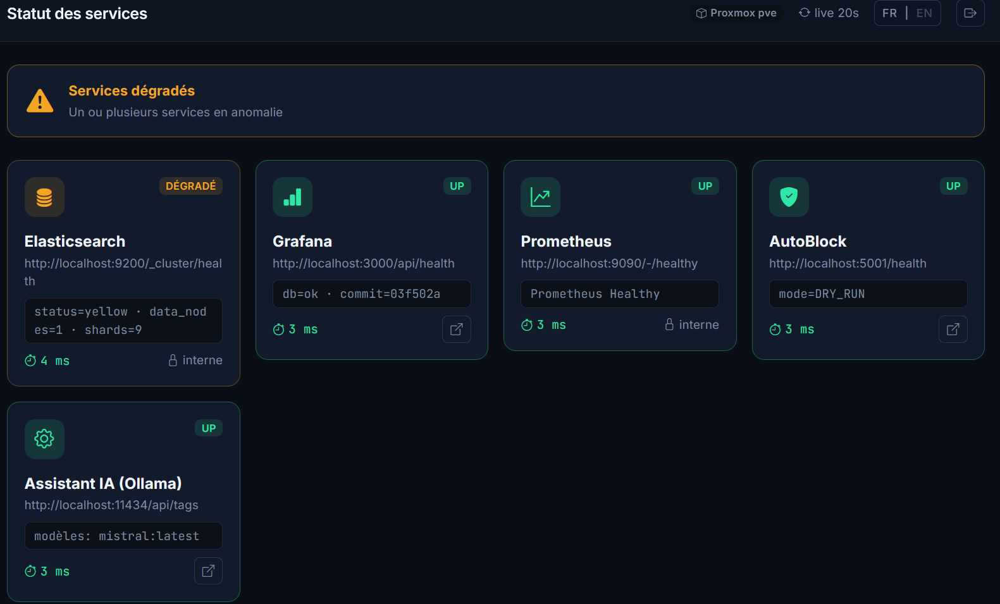
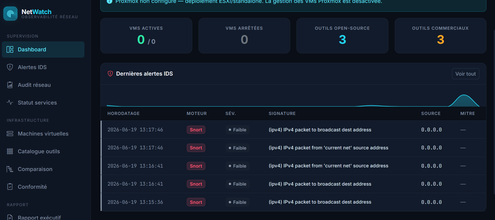
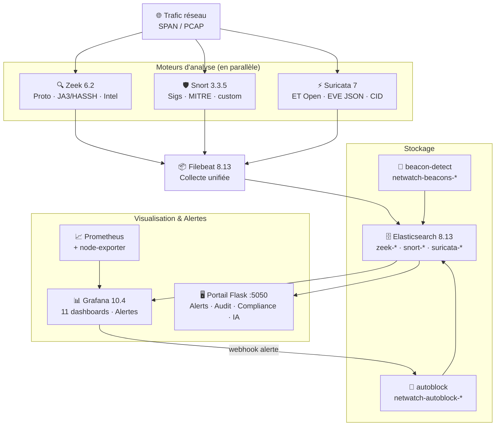

<div align="center">

# 🔭 NetWatch v2

**Stack d'observabilité réseau open-source multi-moteurs**

*Reproduire les fonctionnalités clés d'un outil NPM commercial avec des briques 100% open-source*

---

[](LICENSE)
[](docker-compose.yml)
[](https://www.ecole2600.com)
[](https://www.axians.fr)

---

[](https://zeek.org)
[](https://snort.org)
[](https://suricata.io)
[](https://elastic.co)
[](https://grafana.com)
[](https://prometheus.io)
[](https://python.org)

---

<table>
<tr>
<td align="center" width="33%"><a href="https://zeek.org"></a></td>
<td align="center" width="33%"><a href="https://snort.org"></a></td>
<td align="center" width="33%"><a href="https://suricata.io"></a></td>
</tr>
</table>

</div>

---

## Screenshots

<div align="center">

<table>
<tr>
<td align="center">

<br/><em>Services Status — supervision temps réel des services Docker (Elasticsearch, Grafana, Prometheus, AutoBlock, IA locale)</em>
</td>
</tr>
<tr>
<td align="center">

<br/><em>Dashboard — vue générale avec alertes IDS récentes, KPIs et accès rapide</em>
</td>
</tr>
</table>

</div>

---

## Vue d'ensemble

**NetWatch** est un NDR *(Network Detection & Response)* open-source qui reproduit les fonctionnalités clés d'outils commerciaux comme **Netscout nGeniusONE**, **Corelight** ou **Riverbed** — déployable en moins de 30 minutes sur n'importe quelle VM.

La v2 passe de 4 à **12 services** avec trois moteurs d'analyse IDS en parallèle, un portail web Flask, une IA locale on-prem, une couverture de 4 référentiels de conformité, CrowdSec pour le blocage collaboratif et n8n pour l'automatisation des alertes.

> Projet réalisé par **Nicolas Malok** — Analyste Observabilité NPM @ Axians / Vinci Energies — [École 2600](https://www.ecole2600.com), promo 2024-2027 — SideQuest MVP (S2 2025-2026)

---

## Fonctionnalités

| | Fonctionnalité | Détail |
|---|---|---|
| 🔍 | **3 moteurs IDS en parallèle** | Zeek 6.2 · Snort 3.3.5 · Suricata 7 — même trafic, 3 perspectives |
| 🧠 | **Détection comportementale** | RITA-lite : beaconing C2, connexions longues, DNS tunneling |
| 🚫 | **Réponse automatique** | AutoBlock webhook → iptables (déclenché par Grafana) |
| 🌐 | **Threat Intelligence** | Zeek Intel Framework — Feodo Tracker + URLhaus (auto-update) |
| 📊 | **11 dashboards Grafana** | Réseau, DNS, HTTP/TLS, JA3/HASSH, MITRE ATT&CK, Beacon, VM health |
| 🖥️ | **Portail web Flask** | Alertes · Audit · Compliance · Rapport PDF · IA locale (Ollama/Mistral) |
| 📋 | **Conformité réglementaire** | NIS2 · NIST CSF 2.0 · ANSSI · ISO 27001 — matrices couvert/partiel |
| 🤖 | **IA locale on-prem** | Explication des alertes via Ollama/Mistral — zéro fuite de données |
| 🔐 | **Fingerprinting TLS/SSH** | JA3 · JA3S · HASSH via Zeek |
| ⚡ | **Métriques système** | Prometheus + node-exporter — CPU, RAM, disque, réseau |
| 🕸️ | **Graphe IOC** | Knowledge graph NetworkX — IPs · règles · MITRE TTPs · relations (ioc-graph.py) |
| 🎫 | **Ticketing automatique** | n8n → YAML ticket créé automatiquement sur alerte critique ES |

---

## Les 3 moteurs

<table>
<tr>
<td align="center" width="33%">

### 🔍 Zeek 6.2
**Analyse protocolaire**

Logs JSON natifs (conn, dns, http, ssl, ssh)  
JA3 / HASSH fingerprinting  
Scripts custom : port-scan, entropie DNS (Shannon)  
Intel Framework : watchlists IP + domaines  
Logs intel.log + notice.log → Filebeat

</td>
<td align="center" width="33%">

### 🛡️ Snort 3.3.5
**IDS par signatures**

Build from source (libdaq + tcmalloc)  
17 règles custom SID 1000001–1000017  
Métadonnées MITRE ATT&CK intégrées  
detection_filter anti-flood  
alert_json → Filebeat → ES

</td>
<td align="center" width="33%">

### ⚡ Suricata 7
**IDS + NSM**

Emerging Threats Open (suricata-update auto)  
EVE JSON + Community ID  
Threading multi-cœur (af-packet)  
Auto-reload règles via SIGUSR2 quotidien  
SID custom 2000001–2000999

</td>
</tr>
</table>

---

## Architecture



---

## Pipeline de données

```
Trafic réseau (SPAN / PCAP)
        │
    ┌───┼───┐
    ▼   ▼   ▼
  Zeek Snort Suricata        ← 3 moteurs, même interface
  JSON  JSON  EVE JSON
    └───┬───┘
        ▼
    Filebeat                  ← collecte unifiée
        ▼
 Elasticsearch                ← zeek-*  snort-*  suricata-*
        ▼
 Grafana  +  Portail Flask    ← dashboards + IA locale + PDF
```

---

## Portail web

Le portail Flask (`:5050`) centralise toutes les données en une interface unifiée :

| Page | Description |
|------|-------------|
| `/alerts` | Alertes temps réel, sparklines, auto-refresh 30s, filtres moteur/sévérité |
| `/audit` | Constats priorisés automatiquement, score de posture /100, recommandations |
| `/compliance` | Matrices NIS2 · NIST CSF 2.0 · ANSSI · ISO 27001/27002 (couvert/partiel/hors-périmètre) |
| `/report` | Rapport de conseil PDF : bandeau couverture, KPI cards, sections numérotées |
| `/status` | Santé des 12 services Docker en temps réel |
| `/agents` | Monitoring des agents IA — état, ticket en cours, dernière activité (refresh 15s) |
| `✨ IA` | Explication des alertes via **Ollama/Mistral** — 100% on-prem, zéro fuite de données |

> Interface disponible en **FR / EN** (switch côté client, localStorage)

---

## Quickstart

### Prérequis

- VM **Ubuntu 22.04 LTS** — recommandé : 6 vCPU · 8 Go RAM · 60 Go disque
- **Docker & Docker Compose v2**
- Hyperviseur : Proxmox VE (recommandé) · VMware ESXi · VirtualBox

### 1. Installer Docker

```bash
sudo apt update && sudo apt upgrade -y
curl -fsSL https://get.docker.com | sudo sh
sudo usermod -aG docker $USER && exit
```

### 2. Cloner le dépôt

```bash
git clone https://github.com/Ourslow/netwatch.git
cd netwatch
```

### 3. Configurer l'environnement

```bash
cp .env.example .env
nano .env
```

Variables essentielles :

```bash
IFACE=ens18                                    # Interface de capture (ip a)
SNORT_MONITORED_SERVER=192.168.1.10            # IP serveur à surveiller
GRAFANA_ADMIN_PASSWORD=MonMotDePasse!          # Ne pas laisser "changeme"
AUTOBLOCK_DRY_RUN=true                         # Laisser true pour commencer
SLACK_WEBHOOK_URL=                             # Optionnel
```

### 4. Permissions Filebeat

```bash
sudo chown root:root filebeat/filebeat.yml
sudo chmod 644 filebeat/filebeat.yml
```

### 5. Lancer le stack

```bash
docker compose up -d
docker compose ps   # 10 conteneurs attendus
```

> ⚠️ Le build de **Snort** prend 10-15 min la première fois (compilation depuis les sources).

| Conteneur | Note |
|-----------|------|
| `netwatch-elasticsearch` | Healthy après ~30s |
| `netwatch-snort` | Build long ~15 min (compilation) |
| `netwatch-suricata` | Télécharge ET Open au démarrage |
| `netwatch-beacon-detect` | Analyse toutes les 15 minutes |
| `netwatch-autoblock` | Webhook Grafana sur `:5001` |

### 6. Accéder aux interfaces

| Interface | URL | Credentials |
|-----------|-----|-------------|
| **Grafana** | `http://<IP_VM>:3000` | `admin` / `<GRAFANA_ADMIN_PASSWORD>` |
| **Portail Flask** | `http://<IP_VM>:5050` | `admin` / `netwatch` |
| **Elasticsearch** | `http://<IP_VM>:9200` | — |

### 7. Initialiser GeoIP & Threat Intel (optionnel)

```bash
bash setup-geoip.sh     # Pipeline ingest GeoIP Elasticsearch
bash update-intel.sh    # Watchlists Zeek : Feodo Tracker + URLhaus
```

### 8. Tester avec du trafic

```bash
# Simuler 24h de trafic avec scénarios d'attaque
python3 simulate-traffic.py --hours 24 --intensity medium --attack

# Ou rejouer un PCAP sur les 3 moteurs
./replay-pcap.sh pcap/sample.pcap

# Vérifier les index créés
curl "http://localhost:9200/_cat/indices?v&s=index"
```

---

## Détection

### Scripts Zeek custom

| Script | Seuil | Description |
|--------|-------|-------------|
| `port-scan-detect.zeek` | > 50 ports / 60s | Détection reconnaissance réseau |
| `dns-entropy.zeek` | Entropie Shannon > 3.5 | Détection domaines DGA / C2 |

### Règles Snort custom — MITRE ATT&CK

| SID | Description | ATT&CK |
|-----|-------------|--------|
| 1000001 | ICMP Ping Sweep (10 pings / 60s) | T1595 |
| 1000002 | SSH Brute Force (5 tentatives / 60s) | T1110 |
| 1000003–06 | DNS vers TLD suspects (.xyz, .info, .top, .biz) | T1568 |
| 1000007 | Credentials en clair sur HTTP POST | T1552 |
| 1000008 | Exfiltration potentielle (gros upload) | T1048 |
| 1000009 | Connexion vers port non standard | T1571 |
| 1000010 | User-Agent curl suspect | T1059 |
| 1000011–12 | ICMP Reply flood · SYN Flood HTTP | T1498 |
| 1000013–16 | Accès serveur surveillé (HTTP/HTTPS/SSH/FTP) | T1190 · T1021 |
| 1000017 | Scan de ports vers serveur surveillé | T1046 |

### Détection comportementale — beacon-detect (RITA-lite)

| Détection | Logique | Indicateur |
|-----------|---------|------------|
| **Beaconing C2** | Coefficient de variation < 0.25 (intervalles trop réguliers) | `beacon_score` 0–1 |
| **Longues connexions** | Connexion ouverte > 1h (reverse shell, tunnel, exfiltration lente) | `duration_h` |
| **DNS Tunneling** | Sous-domaine > 40 chars OU > 100 requêtes vers même domaine | `subdomain_length` |

### Conformité réglementaire

| Référentiel | Couverture | Détail |
|-------------|-----------|--------|
| **NIS2** (Art. 21.2) | ✅ Couvert | Surveillance réseau, détection, réponse aux incidents |
| **NIST CSF 2.0** | ✅ Couvert | Fort sur DE (Detect) et RS (Respond) |
| **ANSSI** | 🟡 Partiel | Hygiène informatique + PA-022 supervision réseau |
| **ISO 27001:2022** | ✅ Couvert | A.8.15 (logs) · A.8.16 (surveillance) · A.8.23 (filtrage) |

---

## Dashboards Grafana

| Dashboard | Datasource | Contenu |
|-----------|-----------|---------|
| Vue Réseau | Zeek | Connexions, protocoles, top IPs, conn_state |
| Analyse DNS | Zeek | Requêtes, NXDOMAIN, DGA, types, clients |
| HTTP / TLS | Zeek | Méthodes, statuts, versions TLS, hôtes |
| Alertes Sécurité | Zeek | Port scans, DGA, Intel hits, alertes SSL |
| Alertes Snort 3 | Snort | Signatures, priorités, classes, top sources, MITRE |
| Alertes Suricata 7 | Suricata | ET Open, sévérités, catégories, MITRE ATT&CK |
| Corrélation Multi-Moteurs | Mixed | Zeek + Snort + Suricata sur le même axe temporel |
| Santé VM | Prometheus | CPU, RAM, disque, charge système |
| Top Talkers | Zeek | Top IPs/ports par volume, protocoles, bytes |
| JA3 / HASSH | Zeek | Fingerprints TLS (JA3/JA3S) et SSH (HASSH) |
| Beacon Detector | Beacons | Beaconing C2, longues connexions, DNS tunneling |

---

## Stack technique

| Composant | Outil | Version |
|-----------|-------|---------|
| Analyse protocolaire | Zeek | 6.2 |
| IDS signatures | Snort | 3.3.5 |
| IDS/NSM | Suricata | 7.0 |
| Détection comportementale | beacon-detect (Python) | — |
| Réponse automatique | autoblock (Flask + iptables) | — |
| Transport | Filebeat | 8.13 |
| Indexation | Elasticsearch | 8.13 |
| Visualisation | Grafana | 10.4 |
| Métriques système | Prometheus + node-exporter | 2.51 / 1.7 |
| Portail web | Flask | 3.x |
| IA locale | Ollama / Mistral | — |
| IPS collaboratif | CrowdSec | latest |
| Automatisation alertes | n8n | 2.x |
| Graphe IOC | NetworkX + elasticsearch-py | 3.x / 8.x |
| Orchestration agents IA | agents-deck (Fuskerrs) | 2.0 |
| Orchestration | Docker Compose | v2 |
| OS cible | Ubuntu | 22.04 LTS |

---

## Comparaison open-source vs commercial

| Fonctionnalité | NetWatch v2 | Outils commerciaux |
|----------------|-------------|---------------------|
| Capture & analyse réseau | Zeek (analyse proto) | Corelight · nGenius Probe |
| IDS signatures | Snort 3 + Suricata 7 (ET Open) | Suricata OEM · Snort Enterprise |
| Fingerprinting TLS/SSH | JA3 · HASSH · JA3S (Zeek) | DPI natif (ExtraHop, Corelight) |
| Détection comportementale | RITA-lite (beacon-detect) | Darktrace AI · ExtraHop Reveal(x) |
| Réponse automatique | AutoBlock → iptables | Cisco Stealthwatch + NAC · Palo Alto XSOAR |
| MITRE ATT&CK | EVE JSON Suricata + Snort metadata | Darktrace · Vectra AI |
| Threat Intelligence | Zeek Intel (Feodo + URLhaus) | Anomali · ThreatConnect · MISP |
| Corrélation multi-sources | Dashboard multi-moteurs | nGeniusONE Service Triage |
| Rapport conformité | PDF automatique (Flask) | SIEM intégré |
| Coût | **Gratuit** | 10 000 – 100 000+ €/an |

---

## Structure du projet

```
netwatch/
├── docker-compose.yml              # Orchestration 12 services
├── .env.example                    # Template de configuration
├── replay-pcap.sh                  # Replay PCAP sur les 3 moteurs
├── simulate-traffic.py             # Simulateur de trafic → Elasticsearch
├── setup-geoip.sh                  # Pipeline ingest GeoIP
├── setup-es.sh                     # Index templates ES + pipeline GeoIP (fix T_002)
├── update-intel.sh                 # Mise à jour watchlists Zeek Intel
│
├── zeek/                           # Analyse protocolaire
│   ├── Dockerfile                  # Zeek 6.2 + JA3/HASSH + Community ID
│   ├── local.zeek                  # Config JSON, protocoles, Intel
│   ├── scripts/
│   │   ├── port-scan-detect.zeek
│   │   └── dns-entropy.zeek
│   └── intel/
│       ├── ip_watchlist.dat        # IPs malveillantes (Feodo Tracker)
│       └── domain_watchlist.dat    # Domaines malveillants (URLhaus)
│
├── scripts/
│   ├── security/
│   │   ├── ioc-graph.py            # Graphe IOC NetworkX (IPs·règles·MITRE TTPs)
│   │   └── ioc-graph-output.json   # Export graphe (nodes + edges)
│   └── automation/
│       ├── create-ticket.py        # Création YAML ticket depuis alerte ES (CLI)
│       ├── n8n-alertes-teams.json  # Workflow n8n alertes → Teams
│       ├── n8n-auto-tickets.json   # Workflow n8n alertes critiques → tickets
│       └── deploy-n8n-workflow.sh  # Import auto workflow via API n8n
│
├── snort/                          # IDS signatures MITRE
│   ├── Dockerfile                  # Build from source + libdaq + tcmalloc
│   ├── snort.lua
│   └── local.rules                 # SID 1000001-1000999 + MITRE ATT&CK
│
├── suricata/                       # IDS + NSM
│   ├── Dockerfile                  # suricata-update au démarrage
│   ├── entrypoint.sh
│   ├── suricata.yaml               # EVE JSON, Community ID, af-packet
│   └── local.rules                 # SID 2000001-2000999
│
├── beacon-detect/                  # Détection comportementale RITA-lite
│   ├── Dockerfile
│   └── beacon_detect.py
│
├── autoblock/                      # Réponse automatique
│   ├── Dockerfile
│   └── autoblock.py                # Webhook Flask → iptables
│
├── filebeat/
│   └── filebeat.yml                # 3 sources → zeek-*/snort-*/suricata-*
│
├── elasticsearch/
│   ├── elasticsearch.yml
│   └── pipelines/
│       └── netwatch-geoip.json
│
├── prometheus/
│   └── prometheus.yml
│
├── grafana/
│   ├── provisioning/
│   │   ├── datasources/
│   │   ├── dashboards/
│   │   └── alerting/
│   └── dashboards/                 # 11 fichiers JSON auto-provisionnés
│
└── netwatch/                       # Portail web Flask
    ├── app.py
    ├── llm_client.py               # IA locale Ollama/Mistral
    └── templates/
        ├── alerts.html
        ├── audit.html
        ├── compliance.html
        ├── report.html
        └── status.html
```

---

## Troubleshooting

<details>
<summary><strong>Les capteurs redémarrent en boucle</strong></summary>

Interface réseau incorrecte dans `.env` :

```bash
ip link show          # Lister les interfaces disponibles
# Corriger IFACE= dans .env
docker compose up -d zeek snort suricata
```
</details>

<details>
<summary><strong>Le build Snort échoue</strong></summary>

Connexion internet requise (compilation depuis les sources) :

```bash
docker compose build snort --no-cache
```
</details>

<details>
<summary><strong>Filebeat ne démarre pas — "must be owned by root"</strong></summary>

```bash
sudo chown root:root filebeat/filebeat.yml
sudo chmod 644 filebeat/filebeat.yml
docker compose restart filebeat
```
</details>

<details>
<summary><strong>Les dashboards affichent "No data"</strong></summary>

1. Vérifier la plage horaire Grafana (Last 6h ou Last 24h)
2. Vérifier les index ES :
```bash
curl "http://localhost:9200/_cat/indices?v&s=index"
```
3. Si vide, lancer la simulation :
```bash
python3 simulate-traffic.py --hours 6 --intensity medium --attack
```
</details>

<details>
<summary><strong>AutoBlock ne bloque rien</strong></summary>

C'est le comportement attendu par défaut (`DRY_RUN=true`). Pour activer les vrais blocages :

```bash
# Dans .env
AUTOBLOCK_DRY_RUN=false
docker compose up -d autoblock
```

> ⚠️ Tester d'abord en DRY_RUN — un faux positif peut couper votre accès SSH.
</details>

<details>
<summary><strong>beacon-detect ne détecte rien</strong></summary>

Le service nécessite au minimum 8 connexions entre une même paire src/dst. Générer du trafic C2 synthétique :

```bash
python3 simulate-traffic.py --hours 6 --intensity medium --attack
```
</details>

---

## Commandes utiles

```bash
# Stack
docker compose up -d                                              # Démarrer
docker compose ps                                                 # Vérifier les 10 conteneurs
docker compose logs -f beacon-detect                             # Logs d'un service
docker compose build snort --no-cache && docker compose up -d snort  # Rebuild

# Trafic
./replay-pcap.sh pcap/sample.pcap                                # Replay PCAP
python3 simulate-traffic.py --hours 24 --intensity medium --attack   # Simulation
bash update-intel.sh                                             # Mise à jour threat intel

# Elasticsearch
curl "http://localhost:9200/_cat/indices?v&s=index"              # Index créés
curl "http://localhost:9200/netwatch-beacons-*/_search?pretty&size=5"   # Détections beacon
curl "http://localhost:9200/netwatch-autoblock-*/_search?pretty&size=5" # Blocages
```

---

## Roadmap

| Version | Statut | Contenu |
|---------|--------|---------|
| **v1** | ✅ Mars 2026 | Stack Docker 4 services · 4 dashboards Grafana · Scripts Zeek · Simulateur trafic |
| **v2 Phase 1** | ✅ Juin 2026 | 12 services · CrowdSec · n8n alertes Teams · page /agents · calibrage 12 règles IDS · détection lateral movement |
| **v2 Phase 2** | ✅ Juin 2026 | Fix Filebeat/ES data-stream · graphe IOC NetworkX · ticketing auto n8n → agents-deck · audit sécurité P0/P1/P2 |
| **v3** | 📅 S2 2026 | Shuttle Proxmox physique + SPAN · Intel i350-T2 · Portail gestion VMs · Comparaison open-source vs commercial |

---

## Auteur

**Nicolas Malok**  
Analyste Observabilité NPM @ [Axians / Vinci Energies](https://www.axians.fr) · [École 2600](https://www.ecole2600.com), promo 2024-2027  
SideQuest MVP — S2 2025-2026

---

<div align="center">

[GNU Affero General Public License v3.0](LICENSE) — Toute modification déployée en production doit être rendue publique sous la même licence.

</div>
